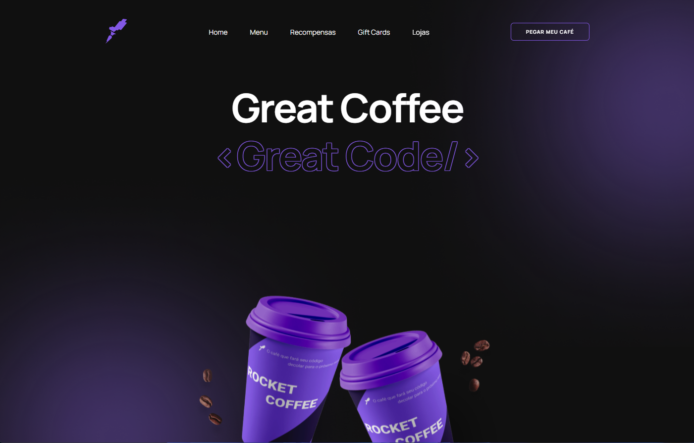

<h1 align="center">
  ☕ RocketCoffee
</h1>

  

<h4 align="center"><a href="https://rocketcoffee-hazel.vercel.app/">Clique para visitar o projeto</a></h4>

## 📚 Sobre o projeto

Desafio do curso Discover da Rocketseat. 
O projeto é uma homepage de uma marca de café, nele eu pude colocar em prática muita coisa que aprendi no curso e nos eventos da NLW, principalmente a funcionalidade do menu mobile. 🚀

## ⚙️ Funcionalidade

☑︎ Menu Toggle para dispositivos menores;

## 🛠️ Tecnologias utilizadas

- HTML
- CSS
- JavaScript
- Animate CSS
