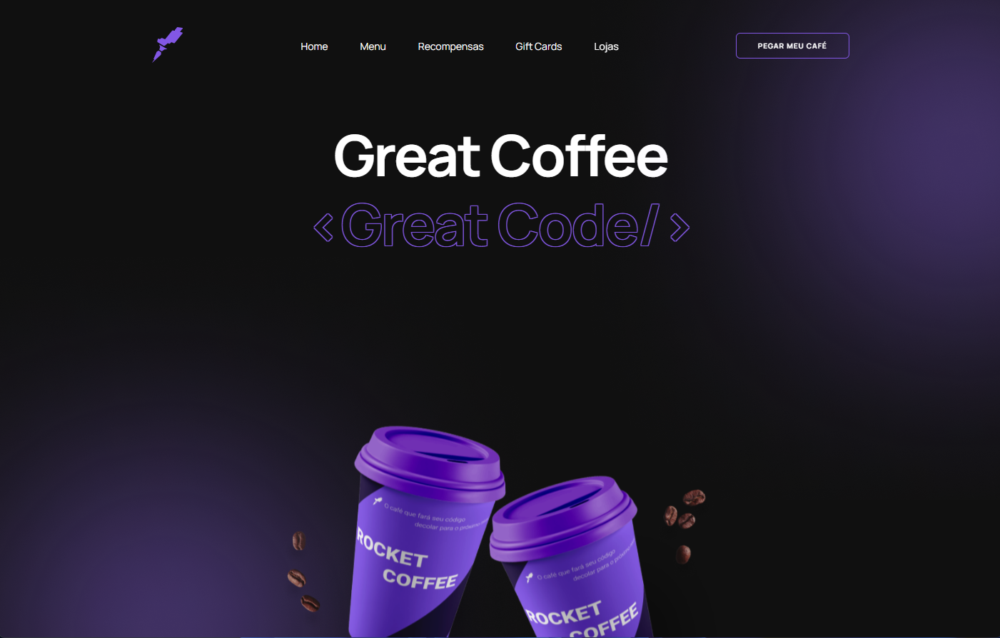

<h1 align="center">
  💻 RocketCoffee
</h1>

<h4 align="center"><a href="https://lucasgabriell97.github.io/rocketcoffee/">Clique para visitar o projeto</a></h4>

## 📚 Sobre o projeto

O desafio se trata de um cartão de perguntas, totalmente responsivo e com a funcionalidade de exibir e esconder a resposta quando o usuário clicar na pergunta. 

## 💼 Tecnologias utilizadas

- HTML;
- CSS;
- JavaScript;
- Animate CSS;
